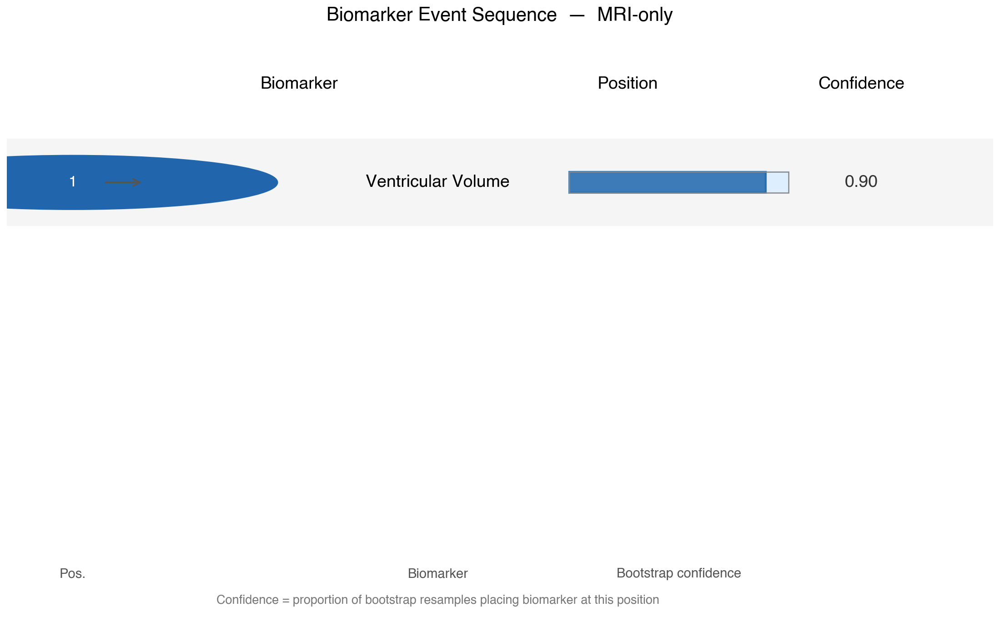
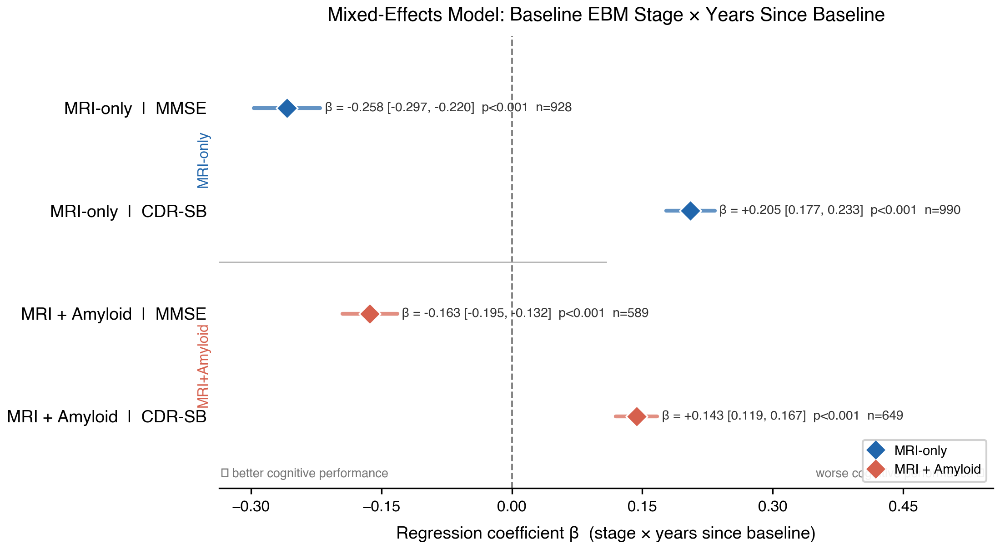

# OASIS-3 Event-Based Model: Staging Alzheimer's Progression

This project reconstructs the order in which brain regions become abnormal over the course of Alzheimer's disease, using an **Event-Based Model (EBM)** fit to structural MRI and amyloid-PET data from the [OASIS-3](https://www.oasis-brains.org/) cohort. Rather than sorting people into coarse clinical buckets (normal / impaired / demented), the model assigns every subject a continuous disease **stage**, derived entirely from their biomarkers — and that stage is then validated against real longitudinal cognitive decline.

## What it does

1. Merges five raw OASIS-3 exports (FreeSurfer MRI morphometry, amyloid-PET, clinical diagnosis, cognitive testing, demographics) into one subject-level dataset.
2. Defines a strict cognitively-normal reference group and residualizes every MRI biomarker against it, removing age/sex/head-size effects.
3. Fits two independent Event-Based Models — an **MRI-only** panel (5 biomarkers, largest sample) and an **MRI + amyloid** panel (6 biomarkers, smaller but molecularly more specific) — via mixture modeling and MCMC search over biomarker orderings.
4. Validates each model three ways: a permutation test, a bootstrap positional-variance analysis, and a face-validity check against clinical dementia severity (hard-fails the pipeline if staging doesn't correlate positively with CDR).
5. Externally validates the resulting stage against **future** cognitive trajectories using mixed-effects models, plus conversion and sensitivity analyses.
6. Generates the figures and tables below.

## Key results

| | MRI-only panel | MRI + amyloid panel |
|---|---|---|
| Subjects (healthy / not) | 1,093 (880 / 213) | 712 (632 / 80) |
| Discovered event order | ventricles → hippocampus → entorhinal cortex → fusiform → inferior-temporal | ventricles → fusiform → **amyloid** → hippocampus → entorhinal cortex → inferior-temporal |
| Stage vs. clinical severity (Spearman ρ) | 0.41 | 0.34 |
| Permutation test p-value | < 0.001 | < 0.001 |
| MMSE decline per stage·year | −0.26 (p < .001) | −0.16 (p < .001) |
| Odds ratio, AD diagnosis per stage | 1.95× | 2.22× |

In both panels, average stage rises monotonically from cognitively normal → impaired → demented, and a higher baseline stage independently predicts faster future cognitive decline and higher odds of an AD diagnosis — despite the model never being told anyone's diagnosis while the staging itself was built.

The MRI + amyloid panel's non-CN sample (n=80) falls below this project's own confirmatory threshold and is treated as exploratory (see `docs/cohort_size_warning.md`).





## Results

### Sample Characteristics

The final analytic sample comprised 1,093 participants meeting eligibility criteria for the MRI-only biomarker panel (880 cognitively normal, 213 classified as cognitively impaired or demented) and 712 participants for the MRI plus amyloid panel (632 cognitively normal, 80 cognitively impaired or demented). The reduced sample size in the amyloid inclusive panel reflects the requirement of a complete amyloid PET measurement, which was unavailable for a subset of participants. Cohort characteristics by diagnostic group are summarized in Table 1.

### Event Sequence and Model Validity

The event based model identified a single maximum likelihood sequence of biomarker abnormality for each panel. In the MRI-only panel, the estimated sequence was ventricular enlargement, followed by hippocampal volume loss, entorhinal cortical thinning, fusiform volume loss, and inferior temporal volume loss. In the MRI plus amyloid panel, the estimated sequence was ventricular enlargement, fusiform volume loss, amyloid positivity, hippocampal volume loss, entorhinal cortical thinning, and inferior temporal volume loss (Figure 2).

A permutation test with 5,000 iterations indicated that the observed sequence likelihood was extremely unlikely to have arisen under a null model with no true ordering, for both the MRI-only panel and the MRI plus amyloid panel, *p* < .001. Convergence diagnostics based on comparison of the modal sequence across the first and second halves of the retained MCMC samples, following a 25% burn in, indicated stable convergence for both panels. Bootstrap resampling (500 iterations) was used to generate a positional variance diagram characterizing the stability of each biomarker's position within the sequence (Figure 1).

Face validity of the derived staging was assessed by correlating each participant's estimated EBM stage with an independent, clinician administered measure of dementia severity (Clinical Dementia Rating global score). Spearman correlations were positive and statistically significant for both panels, ρ = .41 for the MRI-only panel and ρ = .34 for the MRI plus amyloid panel. Mean stage increased monotonically across diagnostic groups in both panels. In the MRI-only panel, mean stage was 1.08 among cognitively normal participants, 2.26 among cognitively impaired participants, and 3.45 among participants with Alzheimer's disease dementia. In the MRI plus amyloid panel, corresponding means were 1.55, 3.33, and 4.76, respectively. These findings indicate that EBM stage, derived without reference to clinical diagnosis, recovered a biologically plausible and clinically coherent ordering of disease severity.

### Longitudinal Validation of EBM Stage

To evaluate whether baseline EBM stage predicted subsequent cognitive trajectories, linear mixed effects models were fit with cognitive outcome regressed on the interaction of baseline stage and time since baseline, adjusting for age, sex, and years of education, with a random slope and intercept specified for each participant. Participants with adequate longitudinal follow up were retained for this analysis (MRI-only panel, *N* = 990; MRI plus amyloid panel, *N* = 649).

The stage by time interaction was statistically significant across all outcomes and panels. In the MRI-only panel, higher baseline stage was associated with a steeper annual decline in Mini-Mental State Examination score, β = -0.26, *p* < .001, and a steeper annual increase in Clinical Dementia Rating sum of boxes score, β = 0.21, *p* < .001. In the MRI plus amyloid panel, corresponding estimates were β = -0.16 for MMSE and β = 0.14 for CDR sum of boxes, both *p* < .001 (Table 4, Figure 5). These results indicate that baseline EBM stage predicted the rate, and not merely the level, of subsequent cognitive decline.

### Diagnostic Conversion Analysis

Logistic regression models estimated the association between EBM stage and concurrent diagnostic classification, adjusting for age, sex, and education. In the MRI-only panel, each one unit increase in stage was associated with an odds ratio of 1.95, 95% CI [1.73, 2.21], for an Alzheimer's disease diagnosis relative to cognitively normal status, and an odds ratio of 1.74, 95% CI [1.58, 1.92], for a cognitively impaired diagnosis relative to cognitively normal status. In the MRI plus amyloid panel, corresponding odds ratios were 2.22, 95% CI [1.78, 2.78], for Alzheimer's disease diagnosis, and 1.72, 95% CI [1.50, 1.98], for cognitively impaired diagnosis. All associations were statistically significant at *p* < .001.

Taken together, these results demonstrate that a disease stage derived exclusively from cross sectional biomarker data, without reference to diagnostic labels during model estimation, was independently associated with both future cognitive decline and concurrent clinical diagnosis across two separately constructed biomarker panels.

## Repository structure

```
config.py                  Central configuration: paths, column names, thresholds, model parameters
scripts/
  00_extract_merge.py       Merge and QC-filter raw OASIS-3 exports
  01_data_prep.py           Diagnosis derivation, CN reference, residualization, z-scoring
  02_feature_engineering.py Build the two EBM biomarker panels
  03_ebm_staging.py         Core EBM: mixture models, MCMC, permutation test, bootstrap, staging
  04_longitudinal_validation.py  Mixed-effects models, conversion analysis, sensitivity checks
  05_figures.py              Publication figures
utils/                       Shared I/O, logging, and validation helpers
docs/                        Environment snapshot and cohort-size caveats
results/                     Figures, tables, and summary-level outputs (see below)
data/                        Not included — see Data section
```

## Data

This repository does **not** include any OASIS-3 data. Raw imaging and clinical data are distributed under OASIS-3's own data use agreement and cannot be redistributed. To run this pipeline yourself, request access at [oasis-brains.org](https://www.oasis-brains.org/) and place the required exports under `data/raw/` (see `config.py` for expected filenames).

Subject-level derived outputs (per-subject stage assignments, MCMC traces, bootstrap sequences, fitted mixture models) are likewise excluded from `results/`. What is included is aggregate: figures, summary tables, and group-level statistics.

## Running the pipeline

Requires Python 3.11+. Install dependencies with:

```
pip install -r requirements.txt
```

With `data/raw/` populated, run the scripts in order:

```
python scripts/00_extract_merge.py
python scripts/01_data_prep.py
python scripts/02_feature_engineering.py
python scripts/03_ebm_staging.py
python scripts/04_longitudinal_validation.py
python scripts/05_figures.py
```

## Method reference

The Event-Based Model follows Fonteijn et al. (2012), *"An event-based model for disease progression and its application in familial Alzheimer's disease and Huntington's disease,"* NeuroImage, using the [`kde_ebm`](https://github.com/ucl-pond/kde_ebm) implementation from the UCL POND group.

## Citing OASIS-3

Any use of this pipeline against real OASIS-3 data should cite the dataset itself, per its data use agreement:

> LaMontagne, P. J., Benzinger, T. L., Morris, J. C., et al. (2019). OASIS-3: Longitudinal Neuroimaging, Clinical, and Cognitive Dataset for Normal Aging and Alzheimer Disease. *medRxiv*. https://doi.org/10.1101/2019.12.13.19014902

## License

The code in this repository is released under the [MIT License](LICENSE). This license does not extend to OASIS-3 data itself, which remains governed by its own data use agreement.
